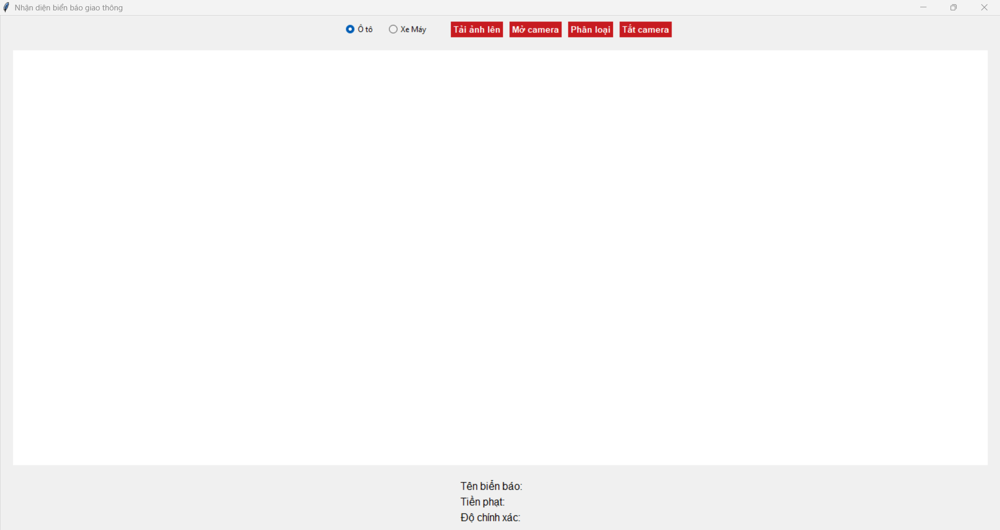
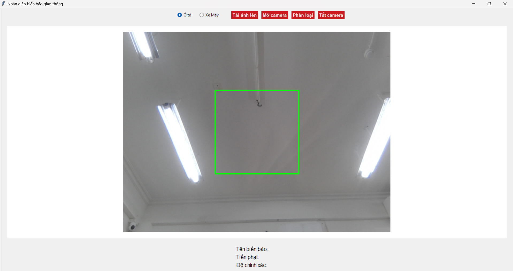
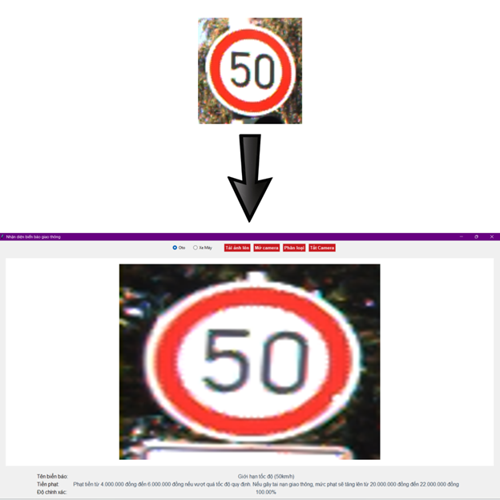
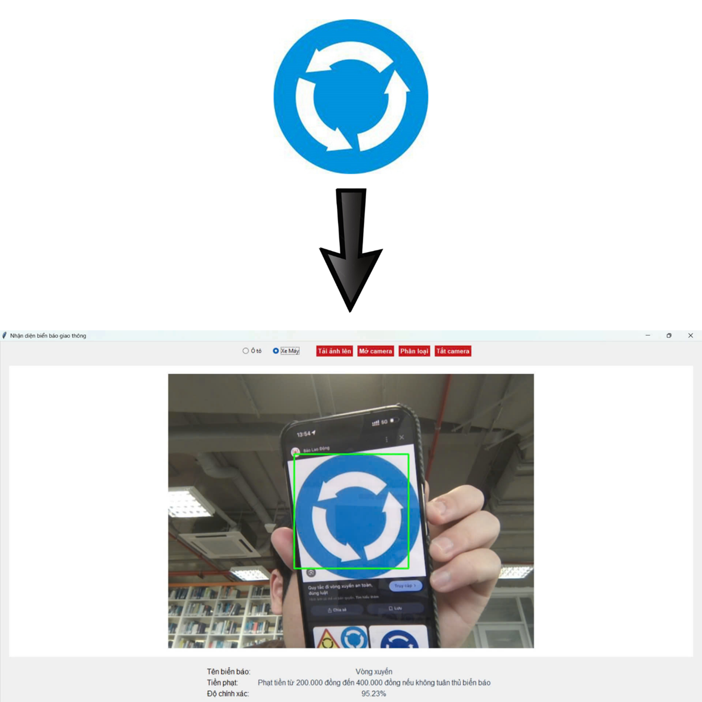

# Traffic Signs Recognition System

A traffic sign recognition system using Deep Learning with Convolutional Neural Network (CNN) and Tkinter GUI interface.

## Abstract

This project focuses on improving road safety by creating a system that can recognize and classify traffic signs. The main goal is to help drivers follow traffic rules and avoid accidents by identifying signs in real-time. To achieve this, a deep learning model was built using Keras, a popular deep learning framework. The model uses a Convolutional Neural Network (CNN) and was trained on the German Traffic Sign Recognition Benchmark (GTSRB) dataset. The results showed high accuracy (95.2% on test set) in recognizing different types of signs, even in challenging conditions. This success suggests that the system could be used in real-life situations, such as in a car app that uses a dashcam to detect signs and give drivers instant warnings and directions.

**Keywords**: Traffic sign classification, Deep Learning, CNN (Convolutional Neural Network), Keras, Road safety, Real-time detection.

## Demo Screenshots

### GUI Interface

*Main application interface with vehicle type selection and control buttons*

### Real-time Camera Detection

*Real-time traffic sign detection using camera with green crop box*

### Classification Results

*Traffic sign classification results through image upload - showing sign name, fine amount, and confidence level*


*Traffic sign classification results through real-time camera detection - displaying recognition results with live camera feed*

## Features

- ✅ Recognizes 43 types of traffic signs according to GTSRB standard
- 🖥️ User-friendly graphical interface (Tkinter)
- 📷 Supports image upload from file or real-time camera capture
- 💰 Displays fine information according to Vietnamese law for each vehicle type (car/motorbike)
- 🎯 High accuracy with 90% confidence threshold
- ⚡ Real-time processing with 200x200 pixels crop frame
- 🔄 Automatically resizes input images to 30x30 pixels for model

## Model Architecture

### CNN Architecture
```
Input (30x30x3) 
    ↓
Conv2D(32, 5x5) + ReLU
    ↓  
Conv2D(32, 5x5) + ReLU
    ↓
MaxPooling2D(2x2) + Dropout(0.25)
    ↓
Conv2D(64, 3x3) + ReLU
    ↓
Conv2D(64, 3x3) + ReLU  
    ↓
MaxPooling2D(2x2) + Dropout(0.25)
    ↓
Flatten() → Dense(256) + ReLU + Dropout(0.5)
    ↓
Dense(43, softmax) → Output
```

### Training Parameters
- **Dataset**: German Traffic Sign Recognition Benchmark (GTSRB)
- **Classes**: 43 traffic sign types (classes 1-43 in code)
- **Input size**: 30×30×3 pixels
- **Optimizer**: Adam
- **Loss function**: Categorical Crossentropy
- **Epochs**: 15
- **Batch size**: 32
- **Train/Test Split**: 80/20
- **Confidence threshold**: 90% (in GUI)

## Results

Based on training and evaluation process:

| Metric | Training Set | Test Set |
|--------|-------------|----------|
| **Accuracy** | **98.7%** | **95.2%** |
| **Precision** | **97.8%** | **94.5%** |
| **Recall** | **98.1%** | **94.8%** |
| **F1-score** | **97.9%** | **94.6%** |

## System Requirements

- Python 3.7+
- Libraries listed in `requirements.txt`
- Camera (for real-time photo capture feature)
- RAM: Minimum 4GB (recommended 8GB+)
- GPU: Not required (only needed for training)

## Installation

1. **Clone repository:**
```bash
git clone https://github.com/yourusername/traffic-signs-recognition.git
cd traffic-signs-recognition
```

2. **Install required libraries:**
```bash
pip install -r requirements.txt
```

3. **Download GTSRB dataset:**
   - Download dataset from [GTSRB Official](https://www.kaggle.com/datasets/meowmeowmeowmeowmeow/gtsrb-german-traffic-sign)
   - Extract and place in `Train/` and `Test/` folders
   - Ensure you have `Train.csv`, `Test.csv`, `Meta.csv` files

4. **Check model:**
   - File `my_model.h5` is pre-trained
   - If you want to retrain, run `python traffic_signs.py`

## Usage

### Run GUI Application
```bash
python GUI.py
```

### Train Model from Scratch
```bash
python traffic_signs.py
```

## GUI User Guide

1. **🚗 Select vehicle type**: Choose "Car" or "Motorbike" to see corresponding fines according to Vietnamese law
2. **📁 Upload image**: Click "Upload Image" to select image file from computer  
3. **📷 Open camera**: Click "Open Camera" to use real-time camera
4. **🔍 Classify**: Click "Classify" to recognize traffic signs in image/camera
5. **❌ Close camera**: Click "Close Camera" to close camera

### Usage Notes
- Camera will display a 200x200 pixels green crop box in the center of screen
- Place traffic sign within the crop box for best results
- Confidence threshold is set at 90% to ensure accuracy
- If confidence < 90%, system will display "None" and "Unidentified"


## List of 43 Supported Traffic Signs

### Speed Limit Signs (Classes 1-9)
- Speed limits: 20, 30, 50, 60, 70, 80, 100, 120 km/h
- End of speed limit (80km/h)

### Prohibition Signs (Classes 10-18)
- No overtaking, No overtaking for vehicles over 3.5 tons
- No vehicles, No vehicles over 3.5 tons
- No entry, Stop

### Warning Signs (Classes 19-33)
- Dangerous curve left/right, Double curve
- Bumpy road, Slippery road
- Road work, Children crossing
- Pedestrians, Bicycles crossing
- Wild animals crossing, Ice/snow warning

### Mandatory Signs (Classes 34-43)
- Turn right ahead, Turn left ahead
- Go straight only  
- Go straight or turn right/left
- Roundabout, Give way

## Legal Information

Fine amounts are updated according to the **latest Decree of the Vietnamese Government** on penalties for road traffic violations, clearly distinguishing between cars and motorbikes.

### Example Fine Amounts:
- **Speeding (car)**: 4,000,000 - 6,000,000 VND
- **Speeding (motorbike)**: 800,000 - 1,000,000 VND  
- **Not complying with signs (car)**: 400,000 - 600,000 VND
- **Not complying with signs (motorbike)**: 200,000 - 400,000 VND

## Related Research

This project is developed based on comparative research of methods:
- **CNN + Transfer Learning** (Faster R-CNN, YOLO)
- **Traditional Methods** (HOG + SVM)
- **Advanced Architectures** (ResNet, VGG, EfficientNet)

Results show that CNN with optimized architecture achieves the best performance for real-time applications.

## Limitations and Future Improvements

### Current Limitations
- Sensitivity to image noise and lighting conditions
- Difficulty with visually similar traffic signs
- Dependency on GTSRB dataset (German signs)

### Planned Improvements
- 🔄 Advanced data augmentation
- 🏗️ Fine-tuning pre-trained models
- 🤝 Ensemble methods
- 📱 Mobile app deployment
- 🚗 Integration with autonomous driving systems

## License

Distributed under the MIT License. See `LICENSE` for more information.

## Citation

If you use this project in your research, please cite:

```bibtex
@misc{traffic_signs_recognition_2024,
  title={Traffic Signs Recognition System using CNN and Keras},
  author={Bui Anh Linh},
  year={2024},
  publisher={GitHub},
  url={https://github.com/LinhJR87/traffic-signs-recognition}
}
```
---

## Acknowledgments

- [German Traffic Sign Recognition Benchmark (GTSRB)](https://www.kaggle.com/datasets/meowmeowmeowmeowmeow/gtsrb-german-traffic-sign) for dataset
- [Keras Team](https://keras.io/) for deep learning framework
- Research references to papers on traffic sign recognition
- Python and Computer Vision open source community
- Vietnamese traffic law references for fine calculation system
